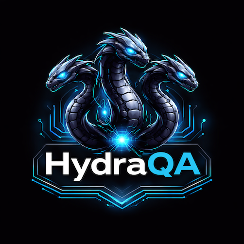

<p align="center">
  
</p>

<h1 align="center">Hydra QA Framework</h1>

<p align="center">
  An orchestrated agent system for managing the full QA lifecycle — from functional refinement to automated E2E testing.
</p>

---

## Overview

Hydra QA Framework is a **dual-context framework** that combines:

1. **Agentic orchestration** (`.github/`) — A system of AI agents that manage the entire QA workflow: refinement, test generation, manual testing, and automation.
2. **E2E test automation** (`e2e/`) — A scalable, maintainable test automation architecture built on **Playwright** + **playwright-bdd** using BDD (Gherkin) and the Page Object Model pattern.

## Quick Start

```bash
# Install dependencies
npm install

# Install Playwright browsers
npx playwright install

# Generate BDD tests and run
npm test

# Run in headed mode
npm run test:headed

# Open HTML report
npm run report
```

## Project Structure

```
hydra-qa-framework/
├── .github/
│   ├── agents/              # Agent definitions (conductor + subagents)
│   ├── instructions/        # Context-specific instructions for agents
│   └── prompts/             # Reusable prompt templates for workflows
├── e2e/
│   ├── features/            # Gherkin feature files (BDD)
│   ├── steps/               # Step definitions (playwright-bdd)
│   ├── pages/               # Page Object Model classes
│   │   ├── components/      # Reusable UI components
│   │   └── base.page.ts     # Abstract base page
│   ├── fixtures/            # Playwright custom fixtures
│   ├── support/             # Helpers, utilities, constants
│   └── config/              # Environment configuration
├── docs/                    # Framework documentation
│   ├── architecture.md      # Automation architecture details
│   ├── agents.md            # Agent system documentation
│   └── workflows.md         # Workflow documentation
├── resources/               # Static resources (logos, assets)
├── playwright.config.ts     # Playwright + BDD configuration
├── package.json
└── tsconfig.json
```

## Documentation

| Document                                     | Description                              |
| -------------------------------------------- | ---------------------------------------- |
| [Architecture](docs/architecture.md)         | E2E automation architecture and patterns |
| [Agents](docs/agents.md)                     | Agent system and roles                   |
| [Workflows](docs/workflows.md)               | QA workflows and agent interactions      |

## Agent System

The framework operates with an orchestrated system of 5 agents:

| Agent        | Role                                                  |
| ------------ | ----------------------------------------------------- |
| **Conductor**  | Orchestrator — coordinates all subagents and user interaction |
| **Refiner**    | Functional analysis and Definition of Ready validation |
| **Generator**  | Test case creation from validated acceptance criteria  |
| **Manual**     | Manual test execution with evidence collection         |
| **Automator**  | E2E test automation with Playwright + BDD              |

## Available Workflows (Prompts)

Use these prompts from VS Code to trigger workflows:

| Prompt                  | Trigger                          |
| ----------------------- | -------------------------------- |
| `new-feature`           | New feature definition           |
| `implementation-ready`  | Test developed implementation    |
| `bug-fix`               | Verify a bug fix                 |
| `tech-debt`             | Technical debt (automation only) |

## Tech Stack

- [Playwright](https://playwright.dev/) — Browser automation
- [playwright-bdd](https://github.com/vitalets/playwright-bdd) — BDD integration with Playwright runner
- [TypeScript](https://www.typescriptlang.org/) — Primary language
- [Gherkin](https://cucumber.io/docs/gherkin/) — Feature file syntax

## License

This project is licensed under the MIT License — see the [LICENSE](LICENSE) file for details.
